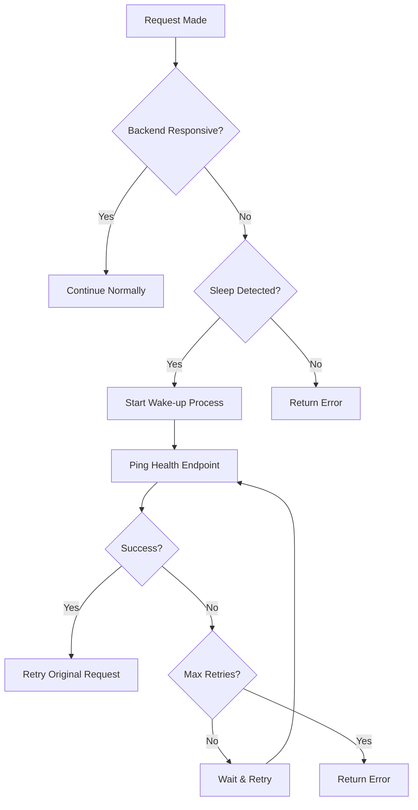

# 🚀 Render Backend Wake-up System Guide

## 📋 Overview

Free-tier hosting services like Render put applications to sleep after 15 minutes of inactivity to save resources. This guide explains the comprehensive wake-up system implemented for Galactiturf to handle this limitation gracefully.

## 🛠️ System Components

### 1. **Frontend Wake-up Service** (`/src/services/wakeupService.ts`)
- **Smart Detection**: Automatically detects when backend is sleeping
- **Retry Logic**: Multiple attempts with exponential backoff
- **Timeout Handling**: 45-second timeout for wake-up attempts
- **Status Tracking**: Prevents duplicate wake-up attempts

### 2. **API Interceptor** (`/src/config/api.ts`)
- **Automatic Retry**: Intercepts failed requests and attempts wake-up
- **Error Detection**: Identifies sleep-related errors (503, 502, 504, timeouts)
- **Seamless Experience**: Retries original request after successful wake-up

### 3. **Wake-up Status Component** (`/src/components/WakeUpStatus.tsx`)
- **User Feedback**: Shows progress during wake-up process
- **Manual Control**: Allows users to manually trigger wake-up
- **Visual Progress**: Animated progress bar during wake-up

### 4. **Standalone Script** (`/src/utils/standalone-wakeup.js`)
- **Independent Operation**: Can run outside the React app
- **Node.js Compatible**: Works in server environments
- **Monitoring Ready**: Suitable for cron jobs and monitoring services

### 5. **GitHub Actions** (`.github/workflows/keep-backend-awake.yml`)
- **Automated Keep-alive**: Runs every 14 minutes during active hours
- **Global Coverage**: Active 6 AM - 11 PM UTC (business hours)
- **Failure Handling**: Alerts and retry logic for failed wake-ups

## 🔧 How It Works

### Detection Algorithm
```typescript
// Backend is considered sleeping if:
1. Request fails completely (network error)
2. Response time > 3 seconds
3. HTTP status: 502, 503, 504
4. Timeout occurs
```

### Wake-up Process


## 🚀 Implementation Details

### 1. Frontend Integration

#### Automatic Wake-up in API Calls
```typescript
import { wakeUpService } from '../services/wakeupService';

// Automatic wake-up before critical operations
const login = async (data) => {
  await wakeUpService.smartWakeUp();
  return authAPI.login(data);
};
```

#### Manual Wake-up Component
```tsx
import WakeUpStatus from '../components/WakeUpStatus';

function App() {
  return (
    <WakeUpStatus 
      showManualWakeUp={true}
      onWakeUpComplete={() => console.log('Backend ready!')}
    />
  );
}
```

#### Status Hook
```typescript
import { useWakeUpStatus } from '../components/WakeUpStatus';

function MyComponent() {
  const { status, checkStatus } = useWakeUpStatus();
  
  useEffect(() => {
    checkStatus();
  }, []);
}
```

### 2. Backend Health Endpoint

The backend provides a comprehensive health check at `/api/health/`:

```json
{
  "status": "healthy",
  "message": "Galactiturf API is running",
  "timestamp": "2024-01-15T10:30:00Z",
  "version": "1.0.0",
  "environment": "production",
  "database": "connected",
  "models": {
    "subscription_tiers": 3,
    "active_games": 12
  }
}
```

### 3. Standalone Usage

#### Command Line
```bash
# One-time wake-up
node src/utils/standalone-wakeup.js --once

# Continuous monitoring (every 14 minutes)
node src/utils/standalone-wakeup.js --keep-alive
```

#### Environment Variables
```bash
REACT_APP_API_URL=https://galactiturf-backend.onrender.com/api
```

#### Browser Console
```javascript
// Available in browser console
window.GalactiturfWakeUp.smartWakeUp().then(result => {
  console.log('Wake-up result:', result);
});
```

## ⚙️ Configuration Options

### Wake-up Service Settings
```typescript
class WakeUpService {
  private readonly WAKE_UP_COOLDOWN = 30000; // 30 seconds
  private readonly WAKE_UP_TIMEOUT = 45000;  // 45 seconds
  private readonly MAX_RETRIES = 3;          // 3 attempts
}
```

### API Interceptor Settings
```typescript
const api = axios.create({
  timeout: 60000, // 60 seconds for wake-up scenarios
});
```

### GitHub Actions Schedule
```yaml
schedule:
  # Every 14 minutes during active hours (6 AM - 11 PM UTC)
  - cron: '*/14 6-23 * * *'
```

## 📊 Monitoring & Analytics

### GitHub Actions Dashboard
- **Workflow Status**: Monitor automated wake-ups
- **Failure Alerts**: Immediate notification of wake-up failures
- **Manual Triggers**: Force wake-up from GitHub interface

### Browser Console Logs
```
🧠 Smart wake-up: Checking backend status...
😴 Backend appears to be sleeping, initiating wake-up...
🔄 Starting backend wake-up process...
⏱️  Wake-up attempt 1/3
✅ Backend awakened successfully!
📊 Response time: 8423ms
```

### Health Check Monitoring
```bash
# Monitor health endpoint
curl https://galactiturf-backend.onrender.com/api/health/

# Check response time
curl -w "%{time_total}s\n" -o /dev/null -s \
  https://galactiturf-backend.onrender.com/api/health/
```

## 🔍 Troubleshooting

### Common Issues

#### 1. **Long Response Times**
- **Symptom**: First request takes 30-60 seconds
- **Cause**: Backend was sleeping
- **Solution**: Automatic - wake-up system handles this

#### 2. **Wake-up Failures**
- **Symptom**: Multiple failed wake-up attempts
- **Cause**: Backend server issues or heavy load
- **Solution**: Check Render dashboard, wait for server recovery

#### 3. **Repeated Sleep Cycles**
- **Symptom**: Backend keeps going to sleep frequently
- **Cause**: Low traffic or GitHub Actions disabled
- **Solution**: Enable GitHub Actions, increase usage

### Debugging Steps

#### Check Wake-up Service Status
```typescript
import { wakeUpService } from './services/wakeupService';

console.log('Wake-up status:', wakeUpService.getStatus());
```

#### Manual Health Check
```bash
# Quick health check
curl -I https://galactiturf-backend.onrender.com/api/health/

# Detailed health check
curl https://galactiturf-backend.onrender.com/api/health/ | jq .
```

#### Check GitHub Actions
1. Go to repository → Actions tab
2. Look for "Keep Backend Awake" workflow
3. Check recent runs and logs

### Error Codes

| Code | Meaning | Action |
|------|---------|--------|
| 502 | Bad Gateway | Backend starting up, wait 30s |
| 503 | Service Unavailable | Backend overloaded, retry |
| 504 | Gateway Timeout | Backend sleeping, wake-up initiated |
| ECONNABORTED | Request timeout | Increase timeout, retry |

## ⚡ Performance Impact

### Frontend Bundle Size
- **Wake-up Service**: ~3KB minified
- **Status Component**: ~2KB minified  
- **Total Impact**: <1% of bundle size

### User Experience
- **Cold Start**: 30-60 seconds (first request after sleep)
- **Warm Requests**: 200-500ms (normal operation)
- **Wake-up Progress**: Visual feedback to users
- **Automatic Retry**: Seamless error recovery

### Server Resources
- **Health Endpoint**: Minimal resource usage
- **Wake-up Requests**: Standard HTTP requests
- **GitHub Actions**: 2-3 minutes/day of runner time

## 🛡️ Security Considerations

### Rate Limiting
- **Cooldown Period**: 30 seconds between wake-up attempts
- **Max Retries**: 3 attempts before giving up
- **Exponential Backoff**: Prevents overwhelming server

### Error Handling
- **Graceful Degradation**: App works even if wake-up fails
- **No Sensitive Data**: Health endpoint exposes only status info
- **Timeout Protection**: All requests have timeout limits

## 🚀 Deployment Checklist

### Frontend Deployment
- [ ] Wake-up service included in build
- [ ] Environment variables configured
- [ ] API interceptor active
- [ ] Status component available

### Backend Deployment
- [ ] Health endpoint accessible
- [ ] CORS configured for frontend domain
- [ ] Comprehensive health data returned
- [ ] Logging enabled for monitoring

### GitHub Actions
- [ ] Workflow file committed
- [ ] Repository variables set (`BACKEND_URL`)
- [ ] Actions enabled in repository settings
- [ ] Schedule active during business hours

### Monitoring Setup
- [ ] Health endpoint monitored
- [ ] GitHub Actions notifications enabled
- [ ] Error tracking configured
- [ ] Performance monitoring active

## 📈 Optimization Tips

### Reduce Sleep Frequency
1. **Enable GitHub Actions**: Keeps backend warm during active hours
2. **Add Real Users**: Organic traffic prevents sleeping
3. **Health Monitoring**: External monitoring services ping regularly

### Improve Wake-up Speed
1. **Optimize Health Endpoint**: Return minimal data quickly
2. **Database Connection Pooling**: Faster database responses
3. **Static File Caching**: Reduce server load

### Enhance User Experience
1. **Preemptive Wake-up**: Wake backend before user actions
2. **Progress Indicators**: Show wake-up progress to users
3. **Offline Capabilities**: Cache data for offline use

## 📞 Support & Maintenance

### Regular Checks
- **Weekly**: Review GitHub Actions logs
- **Monthly**: Analyze wake-up patterns and optimize
- **As Needed**: Update timeout values based on performance

### Upgrades
- **Render Plan**: Upgrade to paid plan to avoid sleeping
- **CDN**: Add Cloudflare for better global performance
- **Monitoring**: Professional monitoring services

---

## ✅ Summary

This comprehensive wake-up system ensures:
- **Seamless User Experience**: Automatic handling of sleep issues
- **Reliable Operations**: Multiple fallback mechanisms
- **Cost Efficiency**: Maximum use of free hosting tiers
- **Professional Monitoring**: Enterprise-grade health checks
- **Easy Maintenance**: Clear debugging and monitoring tools

The system gracefully handles Render's sleep behavior while maintaining a professional user experience. Users rarely notice the backend sleeping, and when they do, clear feedback and progress indicators keep them informed.

**Result**: A production-ready application that works reliably on free hosting! 🎉